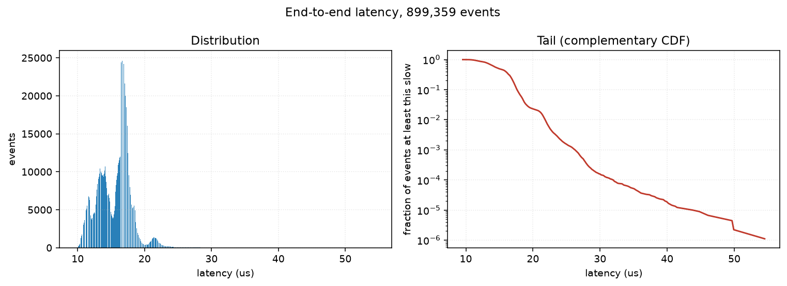
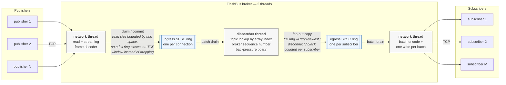

# FlashBus

**A low-latency event-streaming engine in C++20, built to hold a predictable tail under sustained and bursty load.**

[](https://github.com/BruceMoseti/FlashBus/actions/workflows/ci.yml)
[](https://en.cppreference.com/w/cpp/20)
[](LICENSE)

Message brokers are usually optimised for average throughput. In latency-sensitive
systems — market-data distribution, telemetry fan-out, anything where a stalled
consumer must not stall the rest — what matters is the **p99.9**, and the things
that ruin it are allocation on the hot path, lock contention, syscalls per
message, and unbounded queues that convert overload into a crash.

FlashBus is a broker built the other way round. It moves small binary events from
publishers to subscribers over TCP using lock-free single-producer/single-consumer
ring buffers, a 32-byte binary wire protocol, bounded queues everywhere, and zero
heap allocation in the steady state. Every design claim in this repository has a
benchmark or a test behind it, and the numbers were produced by the code you can
read here.

### Highlights

- **11.8 µs p50 / 13.9 µs p99 end-to-end** over real TCP sockets (64-byte events, 100k msg/s), measured publisher-to-subscriber across encode, two socket hops, broker routing, fan-out and decode.
- **Zero heap allocations** in the steady state over a **300-second, 90-million-event** run with **zero dropped events** and +8% p99 drift — verified by a counting `operator new`, not asserted.
- **13–144× lower p99** than a `std::mutex` + `std::queue` baseline. The SPSC handoff cost is flat across a 32× payload range (349 ns to 407 ns) where the mutex queue degrades nearly 11× (1.06 µs to 11.3 µs).
- **1.6 M events/s** fanned out to 4 subscribers with zero loss at 32 µs p50; broker throughput ceiling **5.19 M msg/s** at zero loss.
- **Clean under ASan, UBSan and TSan** across 91 tests in 8 suites, including protocol fuzzing and a full-path soak. ASan found a real out-of-bounds write that every non-sanitised run had passed over.
- **Honest measurement**: a `steady_clock` read costs 24.5 ns here — about as much as an SPSC handoff — so benchmarks that would be distorted by it run twice, once with no clock in the loop. No microarchitectural claim is made anywhere, because this host has no PMU.

### At a glance

| | |
| --- | --- |
| **Language** | C++20 — 4,855 lines of engine, apps and benchmarks, plus 2,185 lines of tests; Python 3 for tooling |
| **Core techniques** | Lock-free SPSC ring buffers, non-blocking sockets + reactor loop, cache-line padding, intrusive hashing, preallocated pools, HDR histograms |
| **Dependencies** | Boost.Asio (sockets only), GoogleTest. No framework does the interesting part |
| **Verified by** | 91 tests in 8 suites × 4 sanitizer configurations, in CI |
| **Measured on** | 8-vCPU Intel Xeon KVM guest, Ubuntu 24.04, g++ 13.3, loopback |

---

## Demo

One publisher, four subscribers, two million 64-byte events through real TCP sockets:

```console
$ ./build/default/apps/flashbus-bench --producers 1 --consumers 4 \
      --messages 2000000 --payload 64 --rate 400000

FlashBus Benchmark
CPU:          Intel(R) Xeon(R) Processor (8 logical)
Kernel:       6.12.94+
Compiler:     g++ 13.3.0 [RelWithDebInfo]
Hardware PMU: NOT available (no vPMU)
Payload:        64 B
Topology:       1 publishers -> broker -> 4 subscribers
Messages:       2000000 published, 8000000 received across subscribers
Throughput:     1.600 M msg/s delivered (over 4.496 s measured window)
Latency:
  p50           31.487 us
  p95           45.055 us
  p99           49.407 us
  p99.9         58.111 us
  max          164.052 us
Dropped:        0 (0 egress overflow, 0 ingress overflow)
Sequence gaps:  0 (0 events)
Egress depth:   1405 high water of 4096
CPU:            7.00 cores, ctx-sw 39v/408i, faults 2216m/0M
Heap allocs:    28 during the run
```

Eight million events delivered, nothing dropped, no sequence gaps, and **28 heap
allocations for the entire run** — all of them at startup.

And the market-data demo: a synthetic exchange feeding a live order book under
bursty load, where every cancel and trade refers to a real live order, so an
unknown order id would mean upstream loss.

```console
$ ./build/default/examples/market_data/market-data-demo --events 1000000 --rate 200000 --burst

Profile:       bursty, base rate 200000 msg/s, order store pool
Events:        1000000 published, 1000000 received, 1000000 applied to the book
Latency us:    p50 17.151  p95 23.679  p99 26.495  p99.9 425.983  max 5213.876
Dropped:       0   sequence gaps 0 (0 events)
Order store:   high water 8192, exhausted 0, unknown-order events 0
Final spreads: 0 1 0 1 3 1 3 -2(crossed) ticks
```

<p align="center">
  
</p>

The left panel is the distribution; the right is the complementary CDF on a log
scale, which is the only view that makes a tail legible. Both are drawn from
histogram bucket counts by `scripts/plot_latency.py` — there is no hard-coded
data anywhere in the plotting code.

---

## Architecture

Two threads, three stages, and **every queue between them is strictly
single-producer/single-consumer**. There is no MPMC queue anywhere in FlashBus:
multiple publishers scale by getting one ingress ring each.



Read left to right: the only shared mutable state in the broker is the two
rings, and the only loss in the system happens at one of the two labelled
edges — deliberately, at the egress one.

| Owned by | What |
| --- | --- |
| **Network thread** | every socket, every read/write buffer, every frame decoder, the session objects, the acceptor |
| **Dispatcher thread** | the routing table, per-topic sequence counters, the backpressure decision |
| **Shared** | exactly one `Channel` per connection: two SPSC rings, a closed flag, and counters |

`Channel` deliberately holds **no socket and no `io_context`**, so either thread
may hold the last reference and destroy it. That single constraint is what keeps
connection teardown free of cross-thread lifetime problems.

## How it works

The path of one event, end to end:

1. **Publisher** stamps a 32-byte header with the topic, a per-publisher
   sequence, and a `steady_clock` reading, appends it to a batch buffer, and
   writes to a blocking socket. The timestamp goes in *before* batching, so any
   delay batching introduces shows up in the measured latency instead of hiding
   in it.
2. **Network thread** reads up to 64 KiB, and a streaming decoder reassembles
   frames from however the bytes happened to arrive — a header split across
   three `recv()` calls is normal and tested. Each complete frame is written
   directly into an ingress ring slot via `claim()`/`commit()`.
3. **Dispatcher thread** drains ingress rings round-robin, looks the topic up by
   **array index** (not a hash), stamps a per-topic broker sequence, and copies
   the frame into each subscribed session's egress ring.
4. **Network thread** drains each egress ring, encodes a batch of frames into
   one preallocated buffer, and issues **one `write()` per batch** rather than
   per message.
5. **Subscriber** decodes, compares the broker sequence against what it expected,
   and reports gaps — so it can tell "the publisher never sent it" apart from
   "FlashBus dropped it for me".

The event loop is a reactor: `io.poll()` → drain egress → arm the next read →
reap closed sessions → park in `epoll` if nothing happened. Three details in
that ordering were bugs first, and they are documented in
[docs/ARCHITECTURE.md](docs/ARCHITECTURE.md).

## Technical deep dive

### Lock-free SPSC ring buffer

`include/flashbus/ring_buffer.hpp`. Power-of-two capacity so indexing is a mask,
not a modulo. The producer owns the write index, the consumer owns the read
index, and each keeps a **private cached copy of the other's index**, refreshing
it only when its cached view says full or empty — which is what lets one
cache-line exchange be amortised over a long run of slots.

Memory ordering is `release` on publish and `acquire` on observe, deliberately
rather than `relaxed` everywhere: the release store of the write index is what
makes the *slot contents* visible, and a test writes a checksum through
`claim()` and verifies it through `front()` across a million handoffs to prove
the pairing actually publishes data and not just an index.

The indices are cache-line padded, and a `PadIndices` template parameter keeps
the unpadded version compiling so the false-sharing experiment compares
*identical code*. See the result below — it is not the result I expected.

### Backpressure: ingress and egress are deliberately asymmetric

This is the design decision I would most want to be asked about.

**Ingress is flow-controlled and lossless.** Before each read, a session
computes how many frames its ingress ring could still absorb and reads at most
that many bytes' worth. Every frame is at least a 32-byte header and the decoder
holds at most one incomplete frame, so reading `(free − 1) × 32` bytes can
produce at most `free` frames. Below two free slots nothing is read at all, the
TCP receive window closes, and the kernel throttles the publisher. In normal
operation this is free: a 4096-slot ring with room to spare permits a read
larger than the read buffer, so the bound never binds until there is real
pressure.

**Egress is bounded and lossy by policy**, per subscriber: `drop-newest`
(default), `disconnect`, or `block`. It cannot be made lossless without
stalling the fan-out for everyone, which is exactly what `block` does and
exactly why it is not the default.

So: **FlashBus never drops an event because a publisher was fast. It drops
events because a subscriber was slow, and it names the subscriber and the
count.** A test asserts that a subscriber which stops reading entirely costs a
healthy subscriber nothing.

### Zero allocation on the hot path, verified rather than claimed

Rings hold **inline fixed-size slots**, so a queued frame needs no indirection,
no refcount and no allocation; the price is a 1 KiB payload ceiling and a ring
that is mostly empty space when payloads are small. Ring storage is
value-initialised at construction so every page is faulted in during startup
rather than during the first burst. Read and write buffers are per-session and
sized once — the write buffer holds exactly one maximum batch, which is an exact
bound rather than a guess because a new batch only starts once the previous one
has fully left.

Tests and benchmarks link a **counting `operator new`** and assert the count
does not move, which is how the sustained run can report zero allocations per
interval for 300 seconds instead of hoping.

### Protocol and the streaming decoder

32-byte fixed header, explicitly little-endian through byte-wise accessors that
fold back to a single load on a little-endian host. Every field that could make
the rest of the parse unsafe is validated before anything uses it: wrong magic,
unknown version, unknown type, non-zero reserved field, or a payload length over
the configured maximum all end the connection. FlashBus never tries to
resynchronise a corrupt stream, because there is no way to know where the next
real header starts.

When nothing is held over from the previous chunk the decoder parses frames **in
place out of the caller's buffer** and copies only the trailing partial frame,
so the common case does not memcpy every byte through an intermediate buffer.

It is tested a byte at a time, at every chunk size from 1 to 137, and fuzzed with
random bytes, bit-flipped valid frames, every truncation of a valid frame, and
absurd declared lengths.

### Order-book consumer

`examples/market_data/`. Orders live in an **intrusive hash chain** — the order
node holds its own `next` pointer — so lookup needs no side table and deletion
needs neither tombstones nor rehashing. Bucket indexing uses Fibonacci hashing
(one multiply and a shift), which tolerates the sequentially-biased ids a feed
produces. Order nodes come from a `Store` policy, and the pooled and heap stores
differ in **exactly one thing**, which is what makes the allocation study an A/B
test rather than a comparison of two different programs.

---

## Performance

Full methodology in [docs/BENCHMARKING.md](docs/BENCHMARKING.md); the five
written-up studies are in [docs/PERFORMANCE.md](docs/PERFORMANCE.md). Everything
below is generated into this file from `results/latest/*.csv` by
`scripts/report.py` — the numbers are not typed by hand, so a stale one shows up
as a diff.

**Methodology, in brief.** Latency is end-to-end, subscriber `steady_clock`
minus the publisher reading carried in the header — one machine, one clock, no
skew to correct. Samples land in a fixed-memory HDR-style histogram accurate to
0.8% that never under-reports. Latency comparisons are **paced below
saturation**, because with an unthrottled producer a queue that cannot keep up
simply stays full and the measured latency becomes capacity ÷ throughput.
Configurations whose spread matters are run repeatedly and reported as the
**median run with the spread beside it**; single runs on this host vary by up
to 3×.

<!-- RESULTS:HEADLINE -->
Measured on Intel(R) Xeon(R) Processor (8 logical), Linux x86_64 / Ubuntu 24.04.4 LTS, kernel 6.12.94+, g++ 13.3.0 `-O2 -g -DNDEBUG`, Boost 1.83.0. Hardware PMU: NOT available.

| What | Measured |
| --- | --- |
| End-to-end over TCP, 64 B, 1 pub / 1 sub, paced at 100k msg/s | p50 **11.84 us**, p99 **13.89 us**, p99.9 17.28 us, 0 dropped |
| SPSC ring handoff, 64 B slots, paced below saturation | p50 **0.41 us**, p99 **0.46 us** (mutex baseline: p50 2.54 us, p99 7.39 us) |
| SPSC ring throughput, 64 B slots, saturated | **15.11 M msg/s** (mutex baseline: 7.18 M msg/s) |
| Broker throughput ceiling, 64 B, zero loss | **5.19 M msg/s** delivered (2 publishers, 8 frames per write()) |
| Highest offered load carried in full, zero loss (4 pub / 1 sub, 64 B) | **1.20 M msg/s** at p50 59.90 us, p99 113.15 us |
| Sustained 300 s at 300k msg/s | 90 M events, **0 dropped**, p99 drift +8%, **0 heap allocations** after the first interval |
<!-- RESULTS:END -->

<!-- RESULTS:TABLES -->
Charts, all drawn from the CSVs in `results/latest/` by `scripts/plot_latency.py`:

* [Overload behaviour](results/latest/overload.png)
* [Queue handoff latency by percentile](results/latest/queue_latency.png)
* [Queue throughput by slot size](results/latest/queue_throughput.png)
* [Sustained load over time](results/latest/sustained.png)
* [Spinning versus parking](results/latest/spin_vs_park.png)
* [Egress batching](results/latest/batching.png)
* [Order-book apply: heap versus pool](results/latest/allocation.png)
* [End-to-end against payload size](results/latest/payload_sweep.png)

### End-to-end latency, 1 publisher / 1 subscriber, 64 B

| offered rate | delivered M msg/s | p50 us | p95 us | p99 us | p99.9 us | dropped |
| --- | --- | --- | --- | --- | --- | --- |
| 50k | 0.05 | 11.71 | 12.67 | 14.14 | 23.04 | 0 |
| 100k | 0.10 | 11.84 | 12.54 | 13.89 | 17.28 | 0 |
| 200k | 0.20 | 14.72 | 17.79 | 20.35 | 23.04 | 0 |
| 400k | 0.40 | 16.89 | 22.78 | 24.70 | 28.80 | 0 |

The pipeline's own cost, well below saturation. Every event crosses two TCP hops, an encode, a decode, two SPSC rings and the dispatcher. Latency starts to climb at 200k msg/s not because the broker is saturated but because the publisher is: one `write()` per event tops out near 0.45 M msg/s on syscall rate, so above that the publisher's own send loop begins queueing.

### End-to-end over TCP, 1 publisher / 1 subscriber, paced

| payload B | M msg/s | p50 us | p95 us | p99 us | p99.9 us | dropped |
| --- | --- | --- | --- | --- | --- | --- |
| 32 | 0.20 | 14.97 | 18.69 | 22.02 | 26.88 | 0 |
| 64 | 0.20 | 15.29 | 18.69 | 22.27 | 26.50 | 0 |
| 128 | 0.20 | 15.29 | 18.82 | 22.14 | 25.60 | 0 |
| 256 | 0.20 | 17.79 | 23.93 | 26.62 | 31.74 | 0 |
| 1024 | 0.20 | 20.99 | 29.82 | 36.35 | 52.99 | 0 |

Latency rises about 40% across a 32x range of payload size, which is what a mostly fixed per-frame cost looks like: the copy is small next to the syscalls and the queue hops around it.

### Overload behaviour, 4 publishers / 1 subscriber, 64 B

| offered M/s | delivered M/s | p50 us | p99 us | p99.9 us | dropped | gaps | cores |
| --- | --- | --- | --- | --- | --- | --- | --- |
| 0.2 | 0.20 | 17.15 | 30.34 | 40.70 | 0 | 0 | 7.0 |
| 0.4 | 0.40 | 25.60 | 42.49 | 50.17 | 0 | 0 | 7.0 |
| 0.8 | 0.80 | 34.05 | 58.62 | 98.30 | 0 | 0 | 7.0 |
| 1.2 | 1.20 | 59.90 | 113.15 | 178.18 | 0 | 0 | 7.0 |
| 1.6 | 1.60 | 92.16 | 221.18 | 2981.89 | 667 | 6 | 6.5 |
| 2.4 | 1.76 | 169.98 | 1269.76 | 1687.55 | 0 | 0 | 6.8 |
| unthrottled | 1.70 | 32636.93 | 64487.42 | 65536.00 | 6014 | 66 | 3.3 |

Delivered tracks offered until the knee, then flattens while latency climbs and the drop counter starts moving. Every dropped event shows up as a subscriber sequence gap, which is the property the broker sequence exists for. Note the CPU column: all four publishers, the broker's two threads and the subscriber share eight vCPUs, so the knee is partly this machine running out of cores.

### What sets the ceiling: frames per read

| load generator | delivered M msg/s | p50 us | dropped | cores |
| --- | --- | --- | --- | --- |
| 1 publisher, 1 frame per write() | 0.45 | 17.79 | 0 | 4.0 |
| 1 publisher, 8 frames per write() | 5.12 | 10616.83 | 0 | 3.4 |
| 1 publisher, 32 frames per write() | 4.83 | 11927.55 | 0 | 3.3 |
| 2 publishers, 8 frames per write() | 5.19 | 27787.26 | 0 | 3.4 |
| 4 publishers, 1 frame per write() | 1.35 | 32505.85 | 7504 | 3.8 |
| 4 publishers, 8 frames per write() | 6.52 | 58982.40 | 906 | 2.4 |

One publisher issuing one `write()` per event cannot offer the broker more than its own syscall rate, which measures 0.45 M msg/s here. Letting it put eight frames in each `write()` multiplies delivered throughput 11x without changing a line of broker code, because the quantity that governs broker throughput is frames per read, not events per second. The large p50 values in the batched rows are queueing delay: these runs are unthrottled on purpose, so the pipeline is full by construction and latency is backlog divided by rate.

### Fan-out, 64 B, each publisher paced at 400k msg/s

| topology | delivered M msg/s | p50 us | p99 us | dropped | cores |
| --- | --- | --- | --- | --- | --- |
| 1 pub / 1 sub | 0.37 | 17.92 | 27.01 | 0 | 4.0 |
| 1 pub / 2 sub | 0.79 | 22.14 | 36.61 | 0 | 5.0 |
| 1 pub / 4 sub | 1.60 | 32.51 | 54.78 | 0 | 7.0 |
| 2 pub / 2 sub | 0.80 | 25.34 | 44.03 | 0 | 6.0 |
| 4 pub / 1 sub | 0.40 | 26.37 | 44.03 | 0 | 7.0 |
| 4 pub / 4 sub | 1.60 | 2572.29 | 11534.33 | 21995 | 7.6 |

Fan-out multiplies delivered throughput without multiplying latency, until the machine runs out of cores: the four-by-four row is this guest trying to run four publishers, four subscribers and the broker's two threads on eight vCPUs, and the drop counter says so.

### False sharing: the same code with the two ring indices on one cache line or two

| ring KiB | mutex M/s | unpadded M/s | padded M/s | padded gain |
| --- | --- | --- | --- | --- |
| 32 | 5.93 | 15.81 | 15.66 | 1.0x |
| 128 | 6.22 | 16.03 | 17.87 | 1.1x |
| 512 | 6.46 | 14.43 | 31.62 | 2.2x |
| 2048 | 6.68 | 15.24 | 78.64 | 5.2x |
| 8192 | 6.28 | 13.11 | 133.88 | 10.2x |
| 32768 | 7.54 | 15.16 | 126.01 | 8.3x |

128 B slots, both threads pinned, median of repeated runs. The unpadded variant is flat no matter how big the ring gets, which is the signature of a fixed per-item cost: the producer's store to the write index invalidates the line holding the read index and vice versa, so every single item pays a coherence round trip. The padded variant has no such floor and scales with the ring, because each side can amortise one index exchange over a longer run of slots. At the smallest ring the two are identical — the effect is invisible until the ring is large enough to expose it, which is why the first version of this experiment found nothing.

### Egress batching: frames coalesced into one write()

| variant | delivered M msg/s | p50 us | p99 us | p99.9 us | cores |
| --- | --- | --- | --- | --- | --- |
| fixed-batch-1 | 0.33 | 306184.19 | 331350.02 | 335544.32 | 2.3 |
| fixed-batch-8 | 0.37 | 18.30 | 26.88 | 29.95 | 4.0 |
| fixed-batch-32 | 0.43 | 18.05 | 26.11 | 30.08 | 4.0 |
| fixed-batch-128 | 0.43 | 17.79 | 25.98 | 30.85 | 4.0 |
| adaptive-batch | 0.50 | 481.28 | 684.03 | 962.56 | 3.9 |

One frame per `write()` is catastrophic: egress becomes syscall-bound near 0.4 M msg/s, the pipeline backs up into the kernel's socket buffers, and p50 lands in the hundreds of milliseconds. Eight and above are all fine and barely distinguishable from each other. The adaptive policy — batch of 1 while the queue is shallow, growing with depth — inherits exactly the problem it was meant to avoid, because a shallow queue is the normal case and a `write()` syscall is not cheap enough to spend on one frame. It is a pessimisation here, and it is kept and reported rather than tuned until it wins.

### Spinning versus giving the core back

| idle spin window | p50 us | p99 us | p99.9 us | cores | ctx switches |
| --- | --- | --- | --- | --- | --- |
| 0us | 68.61 | 122.37 | 127.49 | 2.92 | 248245 |
| 50us | 14.97 | 21.63 | 24.96 | 4.00 | 44 |
| 500us | 16.64 | 24.32 | 28.16 | 4.00 | 35 |
| 5000us | 16.25 | 24.06 | 27.14 | 4.00 | 1 |

The single largest lever on measured latency in the system. Parking immediately saves about one core and costs roughly four times the p50, because the dispatcher has no descriptor to wait on, so its sleep lands directly on the latency of whichever event ends an idle period. A 50 us window already recovers all of it. Every other end-to-end number in this repository was taken at the 500 us default, and this table is published next to them because a latency figure obtained by burning four cores on spin loops is not honest without it.

### Sustained load

| t (s) | M msg/s | p50 us | p99 us | p99.9 us | dropped | heap allocs | RSS MiB |
| --- | --- | --- | --- | --- | --- | --- | --- |
| 15 | 0.30 | 16.51 | 24.45 | 26.75 | 0 | 48 | 21.6 |
| 30 | 0.30 | 17.28 | 25.86 | 29.31 | 0 | 0 | 21.6 |
| 45 | 0.30 | 18.05 | 26.62 | 30.34 | 0 | 0 | 21.6 |
| 60 | 0.30 | 18.05 | 26.75 | 30.98 | 0 | 0 | 21.6 |
| 75 | 0.30 | 18.18 | 26.88 | 30.98 | 0 | 0 | 21.6 |
| 90 | 0.30 | 18.18 | 26.75 | 30.85 | 0 | 0 | 21.6 |
| 105 | 0.30 | 17.79 | 26.11 | 30.08 | 0 | 0 | 21.6 |
| 120 | 0.30 | 17.54 | 25.86 | 29.44 | 0 | 0 | 21.6 |
| 135 | 0.30 | 17.41 | 25.73 | 29.44 | 0 | 0 | 21.6 |
| 150 | 0.30 | 18.05 | 26.50 | 30.21 | 0 | 0 | 21.6 |
| 165 | 0.30 | 18.05 | 26.24 | 29.70 | 0 | 0 | 21.6 |
| 180 | 0.30 | 17.92 | 26.11 | 29.31 | 0 | 0 | 21.6 |
| 195 | 0.30 | 18.05 | 26.11 | 29.57 | 0 | 0 | 21.6 |
| 210 | 0.30 | 17.92 | 26.37 | 30.34 | 0 | 0 | 21.6 |
| 225 | 0.30 | 17.92 | 26.11 | 29.57 | 0 | 0 | 21.6 |
| 240 | 0.30 | 18.05 | 26.37 | 29.95 | 0 | 0 | 21.6 |
| 255 | 0.30 | 17.92 | 26.24 | 29.95 | 0 | 0 | 21.6 |
| 270 | 0.30 | 18.18 | 26.75 | 31.10 | 0 | 0 | 21.6 |
| 285 | 0.30 | 18.05 | 26.50 | 30.34 | 0 | 0 | 21.6 |
| 300 | 0.30 | 18.05 | 26.50 | 30.46 | 0 | 0 | 21.6 |

The columns a five-second benchmark cannot show: whether p99 drifts, whether memory grows, and whether the steady-state allocation count is really zero. It is, from the second interval onward.
<!-- RESULTS:END -->

---

## Engineering decisions

Five decisions where the alternative was reasonable and the trade is worth
stating.

### SPSC rings everywhere instead of one MPMC queue

**Problem.** Several publishers and several subscribers need to hand events to a
router.
**Approach.** One SPSC ring per connection; the dispatcher polls them
round-robin.
**Why.** Ownership can be stated in one sentence and verified by reading two
functions. The entire concurrency surface of the broker is two index words per
ring.
**Alternative considered.** A multi-producer queue, which would have let all
publishers share one ring and removed the round-robin poll.
**Tradeoff.** Polling cost grows linearly with connection count, and I gave up
a single fair queue. In exchange, no CAS loop, no ABA hazard, and a data path a
reviewer can check. For a broker whose point is predictable tails, a
contended CAS loop is the wrong thing to put on the hot path.

### Ingress lossless, egress lossy

**Problem.** A bounded queue has to do something when it fills.
**Approach.** Ingress bounds the *read size* so the TCP window closes and the
kernel throttles the publisher; egress applies a per-subscriber loss policy.
**Why.** An ingress ring has exactly one publisher behind it, so stalling it
inconveniences only that publisher. An egress ring is one leg of a fan-out, so
stalling it stops everyone.
**Alternative considered.** Dropping at ingress too, which is simpler and was
what the first version did.
**Tradeoff.** The read-size calculation is subtle enough to need a proof in a
comment and a test that drives it with a two-frame ring. The payoff is that loss
exists in exactly one place in the system, under explicit policy, and is always
attributable to a named subscriber.

### `DROP_OLDEST` deliberately not implemented

**Problem.** For market data the newest event is the valuable one, so dropping
the oldest queued event is the intuitive policy.
**Approach.** Not offered. `drop-newest`, `disconnect` and `block` are.
**Why.** The oldest queued event sits at the index the *consumer* owns.
Dropping it would require the dispatcher to advance that index — a
compare-exchange on a word that is otherwise single-writer — which would cost
the ring the property that makes it reviewable.
**Alternative considered.** A CAS on the read index, or a separate queue type
with MPSC semantics on the read side.
**Tradeoff.** A policy some users would want is missing. Given that a subscriber
which cannot keep up is already going to lose events either way, the gain did
not justify complicating the one data structure everything depends on.

### Fixed-size inline ring slots instead of refcounted pool blocks

**Problem.** Fanning one event out to N subscribers could share one buffer.
**Approach.** Each ring slot holds a full-size inline frame; fan-out copies.
**Why.** No refcount, no cross-thread free, no indirection on dequeue, and a
memory bound that is known at startup.
**Alternative considered.** Pool-allocated blocks with an atomic refcount, so
fan-out costs one increment instead of one copy.
**Tradeoff.** A 1 KiB payload ceiling, and a 64-byte event occupies a 1088-byte
slot — so the ring's cache footprint is 17× the useful data. That cost is
measured rather than waved away: the ring-capacity sweep in `queue_bench`
quantifies it, and it is the mechanism behind the false-sharing result.

### Blocking sockets in the clients, async only in the broker

**Problem.** The publisher and subscriber clients need to do I/O.
**Approach.** Blocking sockets.
**Why.** A client has one socket and one job. A blocking `write()` is both the
simplest and the lowest-latency way to do it, and asynchronous machinery earns
its complexity where there are many sockets to multiplex — which is the broker.
**Alternative considered.** Async clients sharing the broker's reactor code.
**Tradeoff.** A single-threaded client cannot publish and subscribe on one
connection without risking self-deadlock under the `block` policy. That is
written down in [DESIGN.md](DESIGN.md), and FlashBus's own clients use separate
sockets.

---

## Tech stack

**Language** — C++20 (concepts-free; `std::atomic`, `<bit>`, `std::bit_ceil`, designated init, `std::construct_at`)

**Networking** — Boost.Asio for sockets and the `epoll` reactor only; non-blocking sockets driven by an explicit poll loop rather than `async_write` per frame

**Build & test** — CMake 3.20+ with presets, GoogleTest, CTest, AddressSanitizer / UndefinedBehaviorSanitizer / ThreadSanitizer

**Tooling** — Python 3 for the benchmark runner, chart generation and README table generation; matplotlib; ruff; Linux `perf`; GitHub Actions; Docker; Make

**Systems interfaces used directly** — `epoll` (via Asio), `TCP_NODELAY`, TCP flow control as a backpressure mechanism, `sched_setaffinity`, `getrusage`, `perf_event_open` (to detect PMU availability), `/proc` and `/sys` for machine facts, `rdtscp`

---

## Repository structure

```
include/flashbus/          the library, mostly header-only
├── ring_buffer.hpp        lock-free SPSC ring, padded and unpadded variants
├── protocol.hpp           little-endian codec + fragmentation-tolerant decoder
├── transport.hpp          Channel (the only shared state), policies, Server
├── dispatcher.hpp         topic routing, sequencing, backpressure decision
├── session.hpp            one connection, network-thread side
├── memory_pool.hpp        preallocated block pool with an intrusive free list
├── metrics.hpp            HDR-style histogram, single-writer Counter, results
├── mutex_queue.hpp        the baseline that exists to be beaten
├── clock.hpp              steady_clock reference, validated TSC path, Pacer
├── platform.hpp           machine facts, CPU affinity, rusage, alloc counting
├── message.hpp            header/frame types, topic ids
├── publisher.hpp          publisher client
├── subscriber.hpp         subscriber client with sequence-gap detection
└── cli.hpp                argument parser that rejects what it does not know

src/                       out-of-line implementations (transport, session,
                           dispatcher, clients, platform, metrics)
apps/                      flashbus-server, -pub, -sub, -bench
examples/market_data/      synthetic feed generator + order-book consumer
tests/                     8 suites: ring, protocol+fuzz, pool, histogram,
                           ordering, backpressure, order book, soak
benchmarks/                clock, queue, allocation, affinity, sustained
scripts/                   benchmark runner, plots, README tables, perf,
                           regression comparison
results/latest/            measured CSVs, run logs and the charts drawn from them
docs/                      ARCHITECTURE, BENCHMARKING, PERFORMANCE
DESIGN.md                  the semantics, written before the code
PROJECT_NOTES.md           design rationale and interview notes
```

---

## Getting started

**Prerequisites.** A C++20 compiler (g++ 11+ or clang 14+), CMake 3.20+,
Boost 1.70+ (Asio and system), GoogleTest. Python 3 with matplotlib only if you
want the charts.

```bash
git clone https://github.com/BruceMoseti/FlashBus.git
cd FlashBus

make deps     # apt-get the dependencies (Debian/Ubuntu)
make test     # configure, build, and run the correctness suite
```

Or without `make`:

```bash
CXX=g++ cmake --preset default
cmake --build build/default -j
ctest --test-dir build/default --output-on-failure
```

> `CXX=g++` is explicit because on some distributions `/usr/bin/c++` is a clang
> that cannot find libstdc++. Any working C++20 compiler is fine.

Build presets: `default` (RelWithDebInfo — the build every benchmark number
comes from), `native` (`-march=native`), `asan`, `ubsan`, `tsan`.

In Docker, for a clean-room build:

```bash
docker build -t flashbus .
docker run --rm flashbus                  # correctness suite
docker run --rm flashbus make test-all    # and under every sanitizer
```

## Usage

Three processes — broker, subscriber, publisher:

```bash
./build/default/apps/flashbus-server --port 9000
./build/default/apps/flashbus-sub    --port 9000 --topic trades
./build/default/apps/flashbus-pub    --port 9000 --topic trades --rate 100000 --payload 64
```

The subscriber reports end-to-end latency percentiles and sequence gaps on exit;
the broker reports frames in, routed, delivered, dropped and the egress
high-water mark on `SIGTERM`.

Everything in one process, which is how the benchmarks run:

```bash
./build/default/apps/flashbus-bench --producers 4 --consumers 4 \
    --messages 2000000 --payload 64 --rate 400000 --csv out.csv
```

As a library:

```cpp
#include "flashbus/publisher.hpp"
#include "flashbus/subscriber.hpp"

flashbus::Publisher publisher("127.0.0.1", 9000);
publisher.publish(flashbus::kTopicTrades, payload.data(), payload.size());
publisher.flush();

flashbus::SubscriberConfig config;
config.blocking = false;
flashbus::Subscriber subscriber("127.0.0.1", 9000, config);
subscriber.subscribe(flashbus::kTopicTrades);

subscriber.poll([](const flashbus::MessageHeader& header,
                   const std::byte* payload, size_t size) {
  const uint64_t latency_ns = flashbus::now_ns() - header.timestamp_ns;
  // header.sequence is the per-topic broker sequence; the subscriber tracks
  // gaps in it, so subscriber.missing() is the exact count of lost events.
});
```

Every binary takes `--help` and **rejects an option it does not recognise**
rather than silently keeping a default — a typo in a benchmark flag is how
people publish numbers for a configuration they never ran.

## Testing

```bash
make test       # correctness suite, default build
make test-all   # the same suite under ASan, UBSan and TSan
make lint       # ruff over the Python tooling
```

Correctness and performance are **separate suites on purpose**. "The benchmark
ran" is not "the code is correct"; they answer different questions.

| Suite | What it establishes |
| --- | --- |
| `ring_buffer_test` | Capacity 1, 2 and 1024; wraparound; batch drain spanning the wrap point; producer-faster and consumer-faster; random pauses on both sides; slot *contents* visible after commit across a million handoffs; no allocation in steady state |
| `protocol_test` | Header round-trip; little-endian byte order asserted on the wire; every malformed field rejected; header split across chunks; **every chunk size from 1 to 137**; chunks larger than the decoder's own buffer; fuzzing with random bytes, bit-flipped frames, every truncation, and a 4 GiB declared length |
| `memory_pool_test` | Distinct blocks; exhaustion instead of growth; reuse; high-water tracking; 200k random acquire/release with per-block integrity checks; construct/destroy exactly once |
| `metrics_test` | Histogram percentiles against exact sorted percentiles over a long-tailed distribution, within the documented 0.8%; never under-reports; merge equivalence; TSC validated against `steady_clock` |
| `ordering_test` | FIFO end-to-end over real sockets; ten payload sizes including zero; fan-out to three subscribers; topic isolation; independent per-topic sequences; contiguous sequence across multiple publishers; late joiner sees no false gap; publisher disconnect loses nothing already sent; a garbage stream drops only its own connection |
| `backpressure_test` | Drop-newest counts its losses; disconnect actually closes; the egress ring never exceeds capacity; a two-frame ingress ring throttles the publisher **without loss**; **a stalled subscriber costs a healthy one nothing**; block loses nothing; dropped events surface as subscriber gaps bounded by the broker's own count |
| `order_book_test` | Event wire round-trip; order lifecycle on both stores; unknown orders reported not swallowed; hash-collision chains; crossed books; pool exhaustion; no allocation in the pooled path; generator self-consistency and id uniqueness |
| `stress_test` | 20M ring operations with random stalls; bidirectional rings; 200k randomly fragmented frames; pool churn with integrity checks; full-path soak over real sockets with ordering, gap and drop assertions |

The suite is built to be **portable**, so that a red build means a defect
rather than a small machine. Publisher and subscriber counts and the paced rate
all derive from `available_cpu_count()` — the affinity mask, not
`hardware_concurrency()`, which reports the machine's online CPUs and silently
over-reports inside a cpuset or a container CPU limit. The broker in tests does
not spin before parking, because correctness tests do not measure latency and
the spin window only steals cores the load generators need. And every test that
asserts zero loss paces its publishers, because an unpaced burst into a bounded
egress ring is *entitled* to lose events — that is the design, and a test that
forbids it is testing the wrong thing.

Verified green at 2, 4 and 8 cores under all four configurations.

## Limitations

Stated plainly, because a reviewer should not have to discover them.

- **Not a durable broker.** No persistence, replay, replication or consensus.
  Nothing is written to disk, ever.
- **At-most-once delivery while connected.** A subscriber that falls behind
  loses events per its policy; it can detect exactly how many.
- An event rejected at ingress — which requires the dispatcher to be the
  bottleneck — never reaches the sequencer, so it produces no subscriber gap and
  shows up only in the broker's counters.
- **1 KiB payload ceiling**, from fixed-size inline ring slots.
- No UDP multicast, no gap-recovery channel, no multi-threaded `io_context`.
- **No authentication, no encryption, no rate limiting.** The parser is fuzzed
  and bounded, but FlashBus belongs on a trusted network.
- Topic ids are bounded at 1023 so routing can be an array index.
- **Benchmarks characterise one machine**: a shared 8-vCPU KVM guest with no
  virtual PMU, no CPU isolation, no cpufreq control, and loopback networking.
  **No microarchitectural claim is made anywhere in this repository**, because
  the counters that would support one cannot be read here. Loopback has no
  driver, no PCIe and no wire, and those costs usually dominate on real
  hardware — so these figures are a lower bound, and the relative comparisons
  are far more durable than the absolutes.

## Future work

In the order it would actually be done.

1. **An eventcount wake for the dispatcher.** It has no descriptor to wait on,
   so today it spins for a window and then sleeps, and that sleep lands on the
   latency of whichever event ends an idle period — measured at 4.5× the p50.
   Parking it on a futex signalled by the network thread when it pushes to an
   empty ingress ring, with an atomic "is it sleeping" flag so the signal costs
   nothing when it is awake, would give both low latency and an idle broker that
   uses no CPU.
2. **UDP multicast egress** with sequence-gap detection and no pretence that UDP
   is reliable. Per-subscriber TCP streams are the obvious thing to replace when
   subscriber count grows, since the ceiling study shows the broker's cost is
   per-frame work on the egress side.
3. **A TCP recovery channel** for the gaps multicast leaves — worth building only
   after gap detection has run long enough to show what the gaps look like.
4. **Variable-size ring slots**, to remove the 1 KiB ceiling and the 17× cache
   footprint a small payload pays. The capacity sweep already shows footprint
   drives throughput, so this is the change the measurements point at.
5. **Re-run the microarchitectural experiments on bare metal.** The
   false-sharing result is currently supported by throughput and latency only,
   and it deserves cache-line transfer counts from a real PMU.

---

## Documentation

| Document | What's in it |
| --- | --- |
| [DESIGN.md](DESIGN.md) | The semantics contract — written before the code. Guarantees, non-guarantees, ordering stated precisely, where loss can and cannot happen |
| [docs/ARCHITECTURE.md](docs/ARCHITECTURE.md) | Thread ownership, the event loop and the three ordering bugs in it, backpressure mechanics, memory layout |
| [docs/BENCHMARKING.md](docs/BENCHMARKING.md) | Methodology: what is measured, why the clock is part of the result, pacing, warmup, repetition, what the missing PMU costs |
| [docs/PERFORMANCE.md](docs/PERFORMANCE.md) | Five studies with measurements and reasoning, including two negative results |
| [PROJECT_NOTES.md](PROJECT_NOTES.md) | Design rationale, the hardest problems, bugs found and how, and what I would change |

## License

MIT — see [LICENSE](LICENSE).
